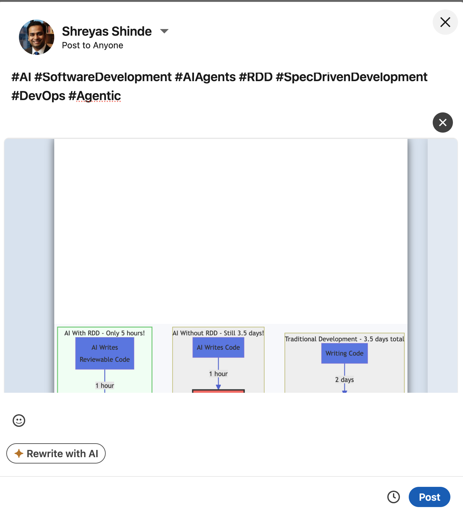

# Growth Kit

[](https://github.com/kanaerulabs/growth-kit/releases/tag/v1.0.0)
[](LICENSE)

> Turn your blog posts into social media content - automatically

Stop manually converting your blog posts into tweets, LinkedIn posts, and Medium articles. Growth Kit does it for you with a single command.

**🚀 Zero Dependencies**: Works in Python, Rust, Go, ANY repo - no Node.js/npm required!

**Works with:** Markdown files, PDFs, blog URLs, or any text content.

---

## What You Can Do

🐦 **Generate [X/Twitter](https://x.com) threads** - Copy-pastable tweets with optimal formatting
💼 **Create [LinkedIn](https://linkedin.com) posts** - Professional posts ready to publish
📝 **Convert to [Medium](https://medium.com)** - Medium-ready articles with proper formatting
🔗 **Generate [Dev.to](https://dev.to) RSS** - Auto-import blog posts to Dev.to
📊 **Set up [Vercel Analytics](https://vercel.com/analytics)** - Add analytics in seconds

**All from a single command.** No configuration needed.

---

## Quick Start

### 1. Requirements

**Claude Code** (required): [Install here](https://www.anthropic.com/claude-code) - it's free

**That's it!** No other dependencies.

- ✅ **Works in ANY repo**: Python, Rust, Go, JavaScript, Java, C++, etc.
- ✅ **No Node.js/npm required** - Claude uses only built-in tools
- ✅ **No package.json needed** - Works in non-JavaScript projects
- ✅ **Universal**: Uses only `bash`, `curl`, `sed`, `grep` (standard everywhere)
- ✅ Just needs **blog content** (markdown files, PDFs, or URLs)

### 2. Install Growth Kit

Open Claude Code in your project and run:

```bash
# Add Growth Kit marketplace (latest stable version)
/plugin marketplace add kanaerulabs/growth-kit@v1.0.0

# Or use latest commit (edge/unstable)
/plugin marketplace add kanaerulabs/growth-kit

# Install plugins
/plugin install publisher
/plugin install analytics
```

### 3. Configure (Optional - LinkedIn API Only)

**X/Twitter, Medium, and Dev.to need ZERO configuration** - they just work!

For LinkedIn API automated posting (optional):

```bash
cp .env.example .env
# Edit .env with your LinkedIn app credentials from https://www.linkedin.com/developers/apps

LINKEDIN_CLIENT_ID=your_client_id
LINKEDIN_CLIENT_SECRET=your_secret
BLOG_BASE_URL=https://yourblog.com
```

**Without API setup**: LinkedIn command still generates the post content - you just copy-paste manually.

### 4. Use It

```bash
# Generate X/Twitter thread from your blog post
/publisher:x my-blog-post

# Or from any markdown file
/publisher:x path/to/article.md

# Or from a URL
/publisher:x https://yourblog.com/article

# Generate Dev.to RSS feed (one-time setup)
/publisher:devto

# Create content for ALL platforms at once
/publisher:all my-blog-post
```

That's it! Growth Kit will:
1. Find and read your content
2. Generate platform-specific formats
3. Open preview files in your browser

**Note**: All commands work in ANY repo type. Claude generates everything using only Read, Write, and Bash tools!

---

## All Commands

### Content Distribution

| Command | What It Does | Example |
|---------|-------------|---------|
| `/publisher:x` | X/Twitter thread | `/publisher:x my-post` |
| `/publisher:linkedin` | LinkedIn post | `/publisher:linkedin my-post` |
| `/publisher:linkedin` | LinkedIn with custom file | `/publisher:linkedin my-post path/to/image.png` |
| `/publisher:medium` | Medium article | `/publisher:medium my-post` |
| `/publisher:devto` | Dev.to RSS feed | `/publisher:devto` |
| `/publisher:all` | All platforms | `/publisher:all my-post` |

### Analytics

| Command | What It Does |
|---------|-------------|
| `/analytics:vercel` | Set up Vercel Analytics |

### Language Support

Add `ja` for Japanese, `en` for English (default):

```bash
/publisher:x my-post ja    # Japanese
/publisher:x my-post en    # English
```

---

## Visual Examples

See exactly what you get with each command:

### X/Twitter Thread


**What you get:**
- Beautiful HTML preview with copy buttons
- 5-8 tweet thread optimized for engagement
- Character counts for each post
- Automatically opens X.com for posting

### LinkedIn Post


*Images and PDFs are automatically uploaded and attached to your post*

**What you get:**
- Professional draft created via LinkedIn API
- **Automatic media upload** - auto-detects and uploads blog diagrams
- **Custom file support** - attach your own images or PDFs
  - Usage: `/publisher:linkedin my-post en path/to/file.pdf`
  - Formats: PNG, JPG, JPEG, PDF
- Ready to review and post with one click
- Proper hashtags and formatting
- Automatically opens LinkedIn.com in browser



### Medium Article


**What you get:**
- Clean HTML preview with one-click copy
- Image upload marker for blog diagram
- Marker shows exact file path for easy uploading
- Medium-ready formatting
- Opens Medium editor automatically

### Dev.to RSS Feed


**What you get:**
- Complete RSS feed with all blog posts
- HTML-encoded content for Dev.to compatibility
- One-time setup for automatic imports
- All future posts sync automatically

---

## How It Works

### Universal Input

Growth Kit accepts **any content format**:

✅ Blog post slug (e.g., `2025-10-13-my-post`)
✅ Markdown file (e.g., `docs/article.md`)
✅ PDF document (e.g., `whitepaper.pdf`)
✅ Blog URL (e.g., `https://yourblog.com/post`)
✅ Plain text file (e.g., `notes.txt`)
✅ HTML file (e.g., `export.html`)

**No configuration needed.** Growth Kit auto-detects:
- Your blog structure
- Your frontmatter format
- Your image locations
- Your content language

**Works in any repo type** (Python, JavaScript, Rust, Go, etc.) - Claude uses only built-in tools (Read, Write, Bash) to generate all content.

### What You Get

**X/Twitter:**
- Claude generates thread directly from blog content
- Opens HTML preview with copy buttons
- 5-8 post thread with optimized character counts
- No dependencies - pure Claude tools (Read, Write, Bash)

**LinkedIn:**
- Claude generates professional post from blog
- Uses curl to post via LinkedIn API (optional)
- Or generates copy-pastable text for manual posting
- No npm/Node.js needed - pure bash/curl

**Medium:**
- Claude converts markdown to Medium format
- Creates HTML preview with one-click copy
- Image upload markers with file paths
- Pure Claude tools - no external scripts

**Dev.to:**
- Claude generates RSS feed from all blog posts
- Creates `public/rss-devto.xml` using Write tool
- Pure bash - no dependencies

---

## Examples

### Example 1: Quick X Thread

```bash
/publisher:x 2025-10-13-my-post
```

**What happens:**
1. Searches your codebase for the blog post
2. Extracts key insights
3. Generates engaging 6-post thread
4. Opens HTML with copy buttons
5. You copy-paste to X/Twitter

**Time saved:** ~30 minutes of manual work

### Example 2: All Platforms at Once

```bash
/publisher:all my-article
```

**What happens:**
1. Generates X/Twitter thread
2. Generates LinkedIn post
3. Generates Medium article
4. Generates Dev.to RSS feed
5. Opens all previews in browser tabs

**Time saved:** ~2 hours of manual work

### Example 3: Dev.to Auto-Import

```bash
/publisher:devto
```

**What happens:**
1. Scans all your blog posts
2. Converts markdown to HTML
3. Generates RSS feed: `public/rss-devto.xml`
4. Shows setup instructions

**One-time setup:**
1. Deploy your site (make RSS publicly accessible)
2. Add RSS URL to https://dev.to/settings/extensions
3. New posts auto-import to Dev.to forever

**Time saved:** Hours per post + automatic future syncing

### Example 4: LinkedIn with Custom File

```bash
# Auto-generate PDF from blog diagrams (default)
/publisher:linkedin my-post

# Or attach your own image/PDF
/publisher:linkedin my-post path/to/custom-image.png
/publisher:linkedin my-post path/to/report.pdf
```

**What happens:**
1. Generates LinkedIn post from blog content
2. Attaches specified file (image or PDF)
3. Creates draft in LinkedIn
4. Opens LinkedIn for review

**Supported file types:**
- Images: `.png`, `.jpg`, `.jpeg`
- Documents: `.pdf`

---

## How It Really Works Under the Hood

**No magic, no dependencies** - just Claude using its built-in tools:

1. **Read tool**: Finds and reads your blog posts (markdown, PDF, URL)
2. **Claude's LLM**: Generates platform-specific content from your blog
3. **Write tool**: Creates HTML previews, RSS feeds, etc.
4. **Bash tool**: Uses `curl` for APIs, `open` for browsers

**For LinkedIn API** (optional):
- Uses `curl` to call LinkedIn REST API
- Pure bash/curl - works in Python repos, Rust repos, anywhere!
- No jq, no Node.js, no npm

**That's it!** The "scripts" are actually just Claude orchestrating its tools based on the command instructions.

---

## Why Growth Kit?

**Built by [Kanaeru Labs](https://www.kanaeru.ai)** while building Kanaeru AI (our product).

We needed to distribute our blog content across platforms efficiently. So we built this.

**Key insights we learned:**
- X/Twitter threads need hooks, not summaries
- LinkedIn needs data points, not fluff
- Medium needs clean markdown, not complex HTML
- Manual conversion wastes hours every week

Now you can benefit from what we learned.

---

## Advanced Usage

### Custom Blog Structures

Growth Kit adapts to YOUR blog structure:

```
✅ Gatsby blogs (content/blog/)
✅ Next.js blogs (posts/)
✅ Astro blogs (src/content/)
✅ Hugo blogs (content/posts/)
✅ Custom setups (any markdown structure)
```

No configuration required. It just works.

### Multi-Language Blogs

If you have both English and Japanese content:

```bash
/publisher:x my-post    # Auto-detects language from path
/publisher:x my-post ja # Force Japanese
/publisher:x my-post en # Force English
```

---

## Troubleshooting

**Q: Command not found?**
A: Make sure you installed the plugin: `/plugin install publisher`

**Q: Can't find my blog post?**
A: Use full path: `/publisher:x src/content/blog/my-post.md`

**Q: Works in Python/Rust/Go repos?**
A: Yes! ALL commands work in any repo type. Claude uses only standard tools (bash, curl, sed) - no language-specific dependencies.

**Q: Want different output format?**
A: The commands are just markdown files in `/commands`. Edit them!

**Q: Need help?**
A: Open an issue: https://github.com/kanaerulabs/growth-kit/issues

---

## Contributing

Growth Kit grows as Kanaeru Labs learns. Contributions welcome!

**Easy contributions:**
- Add new platform commands (Reddit, Bluesky, etc.)
- Improve prompt templates
- Add examples and documentation
- Test with different blog structures

---

## License

MIT License - Use it however you want!

---

## Support

- **Issues**: https://github.com/kanaerulabs/growth-kit/issues
- **Email**: support@kanaeru.ai
- **Website**: https://www.kanaeru.ai

---

**Built with ❤️ by [Kanaeru Labs](https://www.kanaeru.ai)**

*We build [Kanaeru AI](https://www.kanaeru.ai). While building it, we learn. Growth Kit is what we learned about content marketing automation.*
